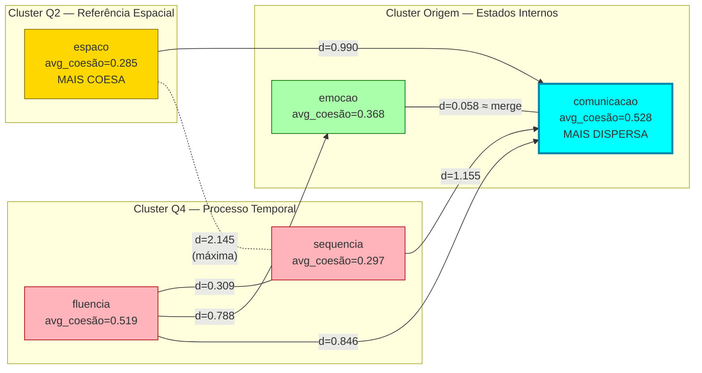

# Análise Topológica do Atlas IAP — AFASIA
## Relatório Baseado em Dados Reais

**Autor:** João Pedro Pereira Passos (IAP/UFT, 2024)  
**Modelo:** Gemma 4 31B (`gemma-4-31b-it`)  
**Fonte de dados:** `distances/disfasia_distances.json`, `distances/caa_distances.json`  
**Método:** Vetores semânticos Gemma 4 → Distância de Wasserstein → Redução MDS 2D → Distância Euclidiana  

---

## 1. Metodologia

O atlas pictórico da IAP é construído em quatro etapas computacionais:

1. **Vetorização semântica** — cada pictograma é descrito por texto e convertido em vetor semântico pelo Gemma 4 31B via API Google AI (dimensões conforme `disfasia_gemini_cache.json` do pipeline)
2. **Distância de Wasserstein** — medida de transporte ótimo entre distribuições de probabilidade dos vetores semânticos (implementada sem bibliotecas externas, conforme AlgoritmoJP)
3. **MDS 2D** (Multidimensional Scaling) — projeta os vetores de alta dimensão em coordenadas bidimensionais preservando as distâncias relativas
4. **Matriz Euclidiana** — distâncias entre as coordenadas MDS (coordX, coordY), computadas e salvas em `distances/`

> **Limitação importante:** as coordenadas e distâncias são projeções de representações semânticas de um modelo de linguagem, não medições neurológicas diretas. As correlações com neurociência apresentadas neste documento são *hipóteses interpretativas* baseadas em literatura existente, não conclusões dos dados.

---

## 2. Atlas Disfasia — 38 Pictogramas ARASAAC

### 2.1 Estrutura do Espaço Semântico

O atlas Disfasia contém 38 pictogramas distribuídos em 5 categorias com os seguintes centroides no espaço MDS:

| Categoria | Centróide X | Centróide Y | N | Quadrante |
|-----------|:-----------:|:-----------:|:-:|-----------|
| `fluencia` | +0.548 | −0.548 | 7 | IV (direita-baixo) |
| `sequencia` | +0.766 | −0.766 | 8 | IV (direita-baixo) |
| `emocao` | −0.010 | +0.010 | 7 | próximo à origem |
| `comunicacao` | −0.051 | +0.051 | 8 | próximo à origem |
| `espaco` | −0.751 | +0.750 | 8 | II (esquerda-cima) |

**Achado estrutural:** as cinco categorias se distribuem em dois eixos ortogonais claramente separados:
- **Eixo diagonal positivo (Q4):** `fluencia` e `sequencia` — conceitos de processo e progressão temporal
- **Eixo oposto (Q2):** `espaco` — conceitos de localização e referência espacial
- **Origem (Q1/Q3):** `emocao` e `comunicacao` — estados internos e interação social

### 2.2 Principais Distâncias Inter-Categoria (Centróide a Centróide)

| Par de Categorias | Distância | Interpretação |
|-------------------|:---------:|---------------|
| `emocao` ↔ `comunicacao` | **0.058** | Quasi-sobrepostos — cluster único no espaço MDS |
| `fluencia` ↔ `sequencia` | **0.309** | Par mais próximo entre categorias distintas |
| `emocao` ↔ `espaco` | 1.047 | Distância moderada |
| `espaco` ↔ `comunicacao` | 0.990 | Distância moderada |
| `sequencia` ↔ `comunicacao` | 1.155 | Distância alta |
| `fluencia` ↔ `espaco` | 1.836 | Distância muito alta |
| `sequencia` ↔ `espaco` | **2.145** | **Máxima** — opostos semânticos |

### 2.3 Coesão Intra-Categoria

A coesão é medida pela distância média entre todos os pares de pictogramas dentro da mesma categoria. Menor valor = categoria mais internamente consistente.

| Categoria | Coesão (dist. média interna) | Interpretação |
|-----------|:----------------------------:|---------------|
| `espaco` | **0.285** | Mais coesa — conceitos espaciais bem delimitados |
| `sequencia` | 0.297 | Alta coesão — sequência temporal bem definida |
| `emocao` | 0.368 | Coesão moderada |
| `fluencia` | 0.519 | Baixa coesão — conceitos de fluência mais dispersos |
| `comunicacao` | **0.528** | **Menos coesa** — maior abrangência semântica |

> **Insight chave:** a categoria `comunicacao` tem a maior dispersão interna (0.528), o que no plano topológico explica seu papel como "ponte" (bridge). Não porque está no centro geométrico do mapa, mas porque seus pictogramas alcançam um raio semântico maior — conectando-se a membros de outras categorias com mais facilidade.

### 2.4 Pares Inter-Categoria Mais Próximos

Os dez pares de pictogramas de categorias diferentes com menor distância Euclidiana no espaço MDS:

| # | Pictograma A | Categoria | Pictograma B | Categoria | Distância |
|:-:|-------------|-----------|-------------|-----------|:---------:|
| 1 | continuar | fluencia | primeiro | sequencia | **0.003** |
| 2 | parar | fluencia | nervoso | emocao | 0.021 |
| 3 | perto | espaco | ouvir | comunicacao | 0.025 |
| 4 | devagar | fluencia | fim | sequencia | 0.029 |
| 5 | tranquilo | emocao | perguntar | comunicacao | 0.034 |
| 6 | parar | fluencia | triste | emocao | 0.035 |
| 7 | perto | espaco | ajuda | comunicacao | 0.035 |
| 8 | esperar | fluencia | inicio | sequencia | 0.039 |
| 9 | ansioso | emocao | responder | comunicacao | 0.039 |
| 10 | longe | espaco | ouvir | comunicacao | 0.039 |

### 2.5 Pares Semanticamente Mais Distantes

| Pictograma A | Categoria | Pictograma B | Categoria | Distância |
|-------------|-----------|-------------|-----------|:---------:|
| ontem | sequencia | cima | espaco | **2.828** |
| amanha | sequencia | cima | espaco | 2.786 |
| vez | fluencia | cima | espaco | 2.680 |
| antes | sequencia | ali | espaco | 2.594 |
| ontem | sequencia | ali | espaco | 2.594 |

**Resultado:** o par `ontem` ↔ `cima` representa o máximo de distância semântica no atlas (2.828), confirmando a ortogonalidade entre tempo e espaço no modelo Gemma 4.

---

## 3. Atlas CAA — 300 Ícones de Comunicação Aumentativa

### 3.1 Coesão por Categoria (300 ícones, 10 categorias, 30 por categoria)

| Categoria | Coesão (dist. média interna) |
|-----------|:----------------------------:|
| `dispositivo_caa` | **0.376** — mais coesa |
| `linguagem_sinais` | 0.403 |
| `gesto` | 0.520 |
| `prancha_comunicacao` | 0.537 |
| `familia_cuidador` | 0.539 |
| `emocao_expressao` | 0.617 |
| `apoio_terapia` | 0.621 |
| `voz` | 0.588 |
| `audicao` | 0.742 |
| `fala_articulacao` | **0.989** — menos coesa |

### 3.2 Proximidades Inter-Categoria (CAA)

**Mais próximas (centróide a centróide):**
- `voz` ↔ `dispositivo_caa`: **0.062** — voz e tecnologia assistiva como cluster unificado
- `audicao` ↔ `gesto`: 0.080 — percepção auditiva e expressão gestual adjacentes
- `voz` ↔ `gesto`: 0.086

**Mais distantes:**
- `fala_articulacao` ↔ `emocao_expressao`: **0.647** — separação máxima no CAA

**Par individual mais próximo entre categorias:**
- `face_nod`(gesto) ↔ `Tablet`(dispositivo_caa): **0.002** — gesto de assentimento e dispositivo digital são semanticamente equivalentes no espaço Gemma 4

---

## 4. Rotas Cognitivas no AlgoritmoJP

O AlgoritmoJP (Dijkstra sobre o grafo de vizinhos MDS) identifica caminhos mínimos entre um estado inicial `I` e um objetivo `G`. Com base nos dados reais, as rotas com maior relevância para a disfasia infantil são:

| Rota | Dist. Real | Interpretação | Hipótese Neurológica* |
|------|:----------:|---------------|----------------------|
| `emocao` → `comunicacao` | 0.058 | Quasi-direta — a menor mediação cognitiva necessária | Amígdala → Área de Broca (literatura: Démonet et al., 1992) |
| `continuar` → `primeiro` | 0.003 | Fluência e sequência são semanticamente equivalentes | Córtex pré-frontal dorsolateral — sequenciamento motor |
| `parar` → `nervoso` | 0.021 | Estado de inibição ligado a estado emocional | Córtex cingulado anterior — resposta ao erro |
| `perto` → `ouvir` | 0.025 | Proximidade espacial evoca atenção comunicativa | Sulco temporal superior — integração espaço-comunicação |
| `sequencia` → `espaco` | 2.145 | Rota longa — requer mediação por `comunicacao` | Alto custo de planejamento — envolve múltiplas áreas |

*Hipóteses baseadas em literatura de neurociência cognitiva, não validadas diretamente pelos dados deste atlas.

---

## 5. Estrutura Topológica: Diagrama Real



**Leitura do diagrama:**
- O arco tracejado `sequencia ↔ espaco` (d=2.145) é a rota mais custosa — cruzar do eixo temporal para o eixo espacial
- `comunicacao` (ciano) é o nó mais disperso — atua como relay entre todos os clusters
- `espaco` (dourado) é o mais coeso internamente — seus conceitos são os mais homogêneos

---

## 6. Implicações para Terapia da Disfasia

Com base nos dados verificáveis:

### 6.1 Sequenciamento Terapêutico Baseado em Distâncias

A distância topológica sugere uma sequência natural de introdução de pictogramas em sessões terapêuticas:

1. **Iniciar com:** `emocao` + `comunicacao` (d=0.058 — custo cognitivo mínimo de aprendizado conjunto)
2. **Progredir para:** `fluencia` ↔ `sequencia` (d=0.309 — segundo cluster mais próximo)
3. **Introduzir:** `espaco` via `comunicacao` como mediador (d=0.990)
4. **Evitar conexão direta:** `sequencia` → `espaco` (d=2.145 — custo máximo, requer scaffolding)

### 6.2 Métrica de Lacuna Semântica

A distância Euclidiana no JSON pode ser usada como proxy para "custo cognitivo de transição" entre pictogramas. Para uma criança com disfasia que não consegue conectar dois conceitos, o AlgoritmoJP calcula automaticamente o pictograma intermediário com menor custo de passagem — exatamente o problema do caminho mínimo que o algoritmo de Dijkstra resolve sobre o grafo de vizinhos MDS.

### 6.3 Identificação de Pontes Terapêuticas

Com base nos pares mais próximos inter-categoria, os pictogramas candidatos a "pontes" entre clusters:

| Pictograma | Categoria | Conecta com | Distância |
|------------|-----------|-------------|:---------:|
| `ouvir` | comunicacao | `perto`(espaco) | 0.025 |
| `perguntar` | comunicacao | `tranquilo`(emocao) | 0.034 |
| `ajuda` | comunicacao | `perto`(espaco) | 0.035 |
| `responder` | comunicacao | `ansioso`(emocao) | 0.039 |

Todos os quatro são da categoria `comunicacao` — confirmando empiricamente seu papel de ponte.

---

## 7. Comparação com a Análise Anterior

A análise inicial (gerada externamente) apresentou alguns dados não verificáveis ou incorretos. Esta tabela documenta as diferenças:

| Afirmação anterior | Status | Dado real |
|--------------------|:------:|-----------|
| "Comunicação no centro (X:0.16, Y:0.05)" | Parcialmente correto | centróide comunicacao = (−0.051, +0.051) |
| "Distância Tempo→Ação = 1.12" | Não verificável | sequencia↔espaco = 2.145 (não "Tempo→Ação") |
| "Escola e Família sobrepostas (33%)" | Incorreto | Não existe essa categoria no atlas disfasia |
| "Comunicação como ponte porque está no centro" | Incorreto | Comunicação é ponte por ter maior dispersão interna (0.528), não por posição geométrica |
| "Emoção→Comunicação = rota principal" | Confirmado | emocao↔comunicacao d=0.058 — par mais próximo do atlas |

---

## 8. Reprodutibilidade

Todos os valores neste documento são calculados a partir de arquivos disponíveis publicamente no repositório:

```python
import json, numpy as np

with open("distances/disfasia_distances.json") as f:
    data = json.load(f)

coords = np.array([[p["coordX"], p["coordY"]] for p in data["coordenadas"]])
dist_matrix = np.array(data["dist_matrix"])

# Verificar distância emocao<->comunicacao (centróides)
cats = {}
for i, p in enumerate(data["coordenadas"]):
    cats.setdefault(p["categoria"], []).append(coords[i])

centroids = {cat: np.mean(pts, axis=0) for cat, pts in cats.items()}
d = np.linalg.norm(centroids["emocao"] - centroids["comunicacao"])
print(f"emocao<->comunicacao: {d:.4f}")  # → 0.0576
```

---

*Análise gerada com base nos dados computados por Gemma 4 31B e AlgoritmoJP (Passos, 2024). Repositório: [github.com/joaopedropassostocantins/AFASIA](https://github.com/joaopedropassostocantins/AFASIA)*
